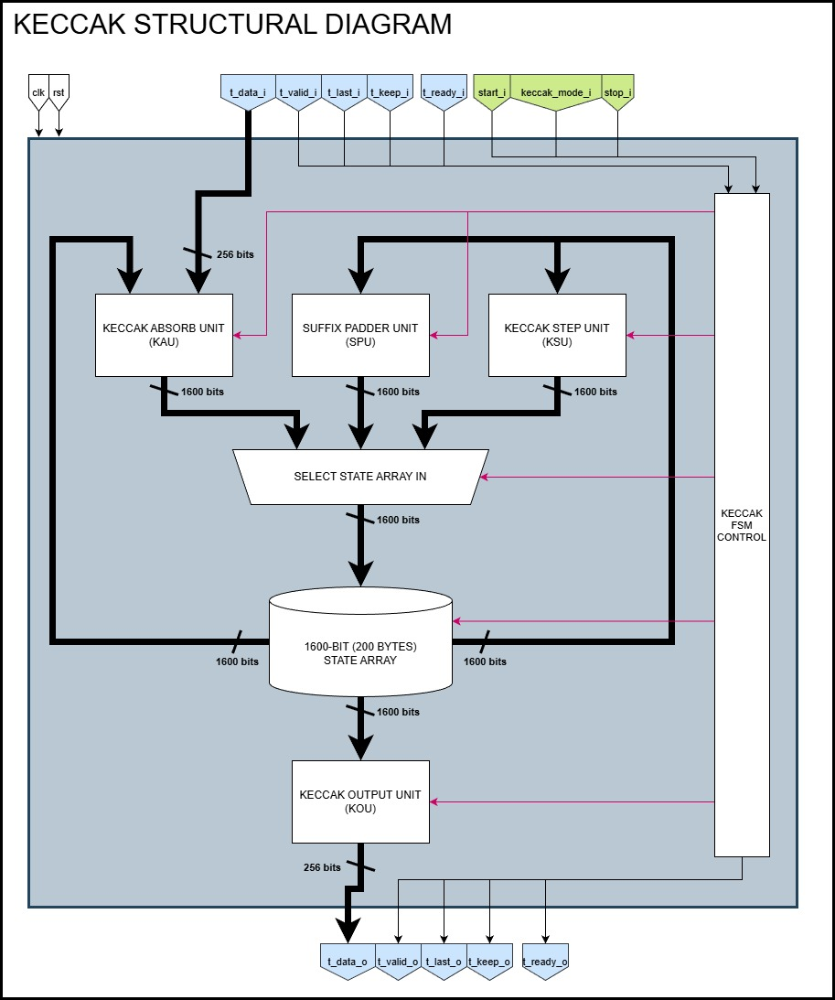
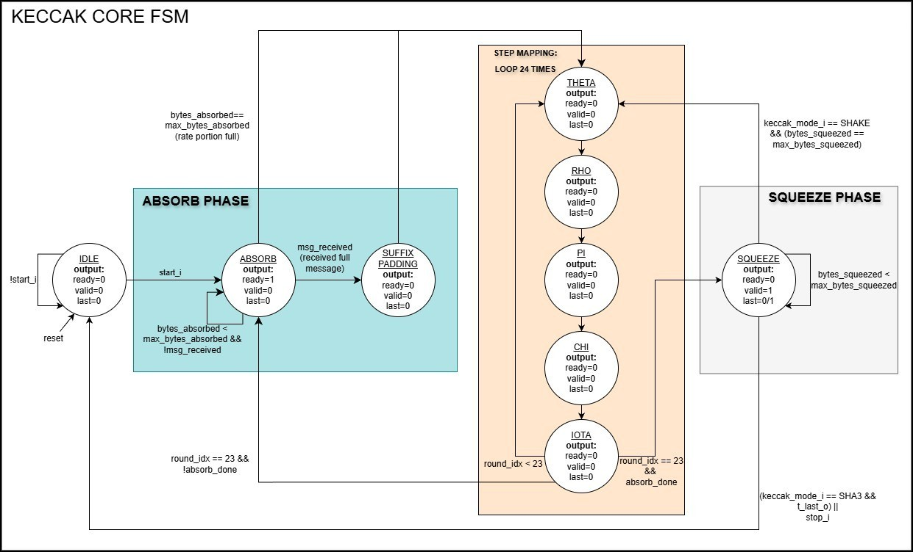

# SystemVerilog Keccak Core (FIPS 202)


A high-frequency, fully synthesizable hardware implementation of the **Keccak Permutation** and **SHA-3/SHAKE** hashing algorithms.

This core utilizes a **Multi-Cycle Iterative Architecture**. To maximize operating frequency ($F_{max}$), the Keccak round function is decomposed into 5 distinct clock cycles ($\theta, \rho, \pi, \chi, \iota$). This reduces the combinatorial path depth significantly compared to single-cycle implementations, making it suitable for high-speed FPGA and ASIC targets.

## 🚀 Key Features

* **FIPS 202 Compliant:** Byte-exact implementation of SHA-3 and SHAKE standards. Verified against **3,592 NIST Test Vectors**.
* **Runtime Configurable:** Switch between 4 modes dynamically via input signals:
    * **Fixed-Length:** SHA3-256, SHA3-512
    * **Extendable-Output (XOF):** SHAKE128, SHAKE256
* **Standard Interface:** **AXI4-Stream** compliant Sink (Input) and Source (Output) with full backpressure support.
* **Robust Architecture:**
    * **Internal Padding:** Automatically handles the FIPS 202 `10*1` padding rule and Domain Separation Suffixes.
    * **Safety Features:** Integrated **SystemVerilog Assertions (SVA)** verify state machine stability, counter overflows, and AXI protocol compliance in real-time.
* **Production Ready:** Written with `default_nettype none` to prevent implicit wire hazards and supports explicit width casting.

## 📊 Supported Modes

| Mode | Security Strength | Rate (r) | Capacity (c) | Suffix |
| :--- | :--- | :--- | :--- | :--- |
| **SHA3-256** | 128-bit | 1088 bits | 512 bits | `01` |
| **SHA3-512** | 256-bit | 576 bits | 1024 bits | `01` |
| **SHAKE128** | 128-bit | 1344 bits | 256 bits | `1111` |
| **SHAKE256** | 256-bit | 1088 bits | 512 bits | `1111` |

## 🔄 Control Protocol

The core follows a strict **Start → Absorb → Permute → Squeeze** lifecycle.

1. **Initialization**
   * Assert `start_i` for one cycle while in `STATE_IDLE`
   * Internally:
     * Mode, rate, and suffix are latched
     * State array is wiped to zero
     * Absorb/squeeze counters are reset

2. **Absorption Phase**
   * Input data is streamed via AXI4-Stream sink
   * Backpressure is applied when permutations are running
   * `t_last_i` marks the final message fragment
   * Arbitrary message lengths are supported via `t_keep_i`

3. **Padding & Final Permutation**
   * FIPS 202 domain suffix and `10*1` padding are injected automatically
   * A final 24-round permutation is executed

4. **Squeeze Phase**
   * Output is streamed via AXI4-Stream source
   * For SHA3 modes, output terminates automatically
   * For SHAKE modes, output continues indefinitely until `stop_i` is asserted

⚠️ **Important:** `keccak_mode_i` must remain stable after `start_i` until the core returns to `STATE_IDLE`.

## 🔌 AXI4-Stream Behavior Notes

### Sink Interface (Input)
* `t_ready_o` is deasserted while permutations are running
* Data is only accepted when `t_valid_i && t_ready_o`
* Input signals must remain stable while `t_ready_o` is low

### Source Interface (Output)
* `t_valid_o` is asserted only when downstream is ready
* Output data, keep, and last remain stable under backpressure
* SHAKE modes may produce unlimited output blocks


## 🛠️ Architecture Overview

### Structural Data Path


The architecture centers around a **1600-bit (200-byte) State Array** that circulates through four specialized processing units in a feedback loop:

* **Keccak Absorb Unit (KAU):** Manages the "Sponge" construction by XORing incoming AXI data streams into the state array. It handles partial-block buffering and rate-boundary crossings.
* **Suffix Padder Unit (SPU):** Injects the domain separation bits (e.g., `0x06` for SHA3) and the FIPS 202 `10*1` padding rule once the message is complete.
* **Keccak Step Unit (KSU):** The computational heart of the core. It executes the 24 rounds of permutations ($\theta, \rho, \pi, \chi, \iota$).
* **Keccak Output Unit (KOU):** Truncates the state array to the desired rate (r) and linearizes the data onto the AXI4-Stream output bus during the Squeeze phase.

### Finite State Machine (Control)


The design is orchestrated by a centralized FSM with the following states:

* **IDLE**
  * Waits for `start_i`
  * Core is quiescent; AXI interfaces inactive

* **ABSORB**
  * Accepts AXI4-Stream input data
  * Handles partial words using `t_keep`
  * Supports carry-over when rate boundaries are crossed
  * Automatically schedules permutations when the rate is full

* **SUFFIX_PADDING**
  * Injects FIPS 202 domain separation suffix
  * Appends final `1` bit according to `10*1` padding rule

* **PERMUTATION PIPELINE**
  * Each Keccak round is decomposed into 5 FSM states:
    * `THETA → RHO → PI → CHI → IOTA`
  * A full permutation requires **24 rounds × 5 cycles = 120 cycles**

* **SQUEEZE**
  * Streams output blocks via AXI4-Stream
  * Automatically re-enters permutation when rate is exhausted
  * Terminates on:
    * Hash completion (SHA3)
    * External `stop_i` (SHAKE)

### Absorption with Rate Boundary Carry-Over

The absorb unit supports input fragments that cross rate boundaries without data loss.

* Partial input words are tracked using `t_keep`
* Excess bytes are buffered internally (`carry_over`)
* Carry-over data is automatically re-injected on the next absorb cycle
* No external re-alignment or padding is required from the user

This allows seamless hashing of arbitrarily-sized messages using wide AXI data paths.

## ⏱️ Performance Characteristics

* **Permutation latency:** 120 cycles per Keccak-f[1600]
* **Absorb throughput:** 256 bits per accepted AXI beat
* **Squeeze throughput:** 256 bits per cycle (subject to backpressure)
* **Critical path:** Single Keccak step (Θ, ρ, π, χ, or ι)

The multi-cycle round decomposition significantly reduces combinational depth,
enabling higher achievable clock frequencies compared to single-cycle designs.


## 🔌 Signal Description

### Parameters
* `DWIDTH`: Input Data Width (Default: **256 bits**)
* `MAX_OUTPUT_DWIDTH`: Output Data Width (Default: **256 bits**)

### Ports

| Signal Group | Name | Direction | Width | Description |
| :--- | :--- | :--- | :--- | :--- |
| **System** | `clk` | Input | 1 | System Clock (Rising Edge) |
| | `rst` | Input | 1 | Synchronous Active-High Reset |
| **Control** | `start_i` | Input | 1 | Pulse high to reset FSM and start new hash |
| | `keccak_mode_i` | Input | 2 | `00`: SHA3-256, `01`: SHA3-512, `10`: SHAKE128, `11`: SHAKE256 |
| | `stop_i` | Input | 1 | Stops output generation (Required for XOF modes) |
| **AXI Sink** | `t_data_i` | Input | 256 | Input Message Data |
| | `t_valid_i` | Input | 1 | Master Valid |
| | `t_last_i` | Input | 1 | Assert high on the final chunk of the message |
| | `t_keep_i` | Input | 32 | Byte Enable (1 bit per byte). `t_keep[0]` is LSB. |
| | `t_ready_o` | Output | 1 | Slave Ready. Core pulls low when processing permutation. |
| **AXI Source** | `t_data_o` | Output | 256 | Hash Output Data |
| | `t_valid_o` | Output | 1 | Master Valid |
| | `t_last_o` | Output | 1 | End of Hash (High for SHA3, Low for SHAKE) |
| | `t_keep_o` | Output | 32 | Byte Enable for output data |
| | `t_ready_i` | Input | 1 | Slave Ready (Backpressure from downstream) |

## 💻 Simulation & Verification

This project utilizes a dual-verification strategy: **SystemVerilog Assertions (SVA)** for runtime protocol checking and **Python-generated NIST vectors** for standard compliance. Continuous Integration (CI) is handled via GitHub Actions to ensure build integrity on every Pull Request.

### 🛡️ NIST FIPS 202 Compliance

This core has been verified against the official **NIST Cryptographic Algorithm Validation Program (CAVP)** test vectors. A dedicated "Heavy" testbench (`keccak_core_heavy_tb.sv`) handles the automated regression of over 3,500 test vectors using a Two-Pass Python Runner to optimize disk usage.

#### Verification Results
| Standard | File Type | Count | Status |
| :--- | :--- | :--- | :--- |
| **SHA3** | `ShortMsg`, `LongMsg` | 100% | ✅ PASS |
| **SHAKE** | `ShortMsg`, `LongMsg`, `VariableOut` | 100% | ✅ PASS |
| **Total** | **All Vectors** | **3,592** | **PASS** |

### 1. Prerequisites (Linux/Ubuntu)
The simulation environment relies on **ModelSim (Intel FPGA Lite)**. Since ModelSim ASE is a 32-bit application, running it on modern 64-bit Linux distributions (like Ubuntu 20.04/22.04) requires specific 32-bit compatibility libraries and a kernel check patch.

---

**Install Dependencies:**
```bash
# 1. Add architecture and update
sudo dpkg --add-architecture i386
sudo apt-get update

# 2. Install core build tools
sudo apt-get install -y wget build-essential

# 3. Install required 32-bit libraries (Required for ModelSim ASE)
sudo apt-get install -y libc6:i386 libncurses5:i386 libstdc++6:i386 \
lib32ncurses6 libxft2 libxft2:i386 libxext6 libxext6:i386
```
**Patching ModelSim (Critical for Modern Linux):**
If ModelSim fails to launch or hangs, apply these patches to the `vco` script (located in `<install_dir>/modelsim_ase/vco`) to fix OS detection and force 32-bit mode:
```bash
# Fix Red Hat directory detection logic
sudo sed -i 's/linux_rh[[:digit:]]\+/linux/g' <path_to_modelsim>/vco

# Force 32-bit mode
sudo sed -i 's/MTI_VCO_MODE:-\"\"/MTI_VCO_MODE:-\"32\"/g' <path_to_modelsim>/vco
```
### 2. Running Simulations
The repository includes a Makefile that handles compiling, running, and waveform generation for multiple testbenches.

---

**Setup Environment:**
Ensure the path in `env.sh` points to your specific ModelSim installation (e.g., `/opt/intelFPGA_lite/...` or `/pkgcache/...`).
```bash
source env.sh
```

**Run All Tests:** This will execute the entire suite of unit tests and the full core integration test.
```bash
make
```

**Run Specific Test:** You can target individual modules (Unit Tests) using the run_<tb_name> target:
```bash
make run_theta_step_tb
make run_keccak_core_tb
make run_keccak_absorb_unit_tb
```
**Clean Artifacts:** Removes generated work libraries and .vcd waveform files.
```bash
make clean
```
**Viewing Waveforms:** Every simulation run automatically generates a corresponding Value Change Dump (.vcd) file (e.g., keccak_core_tb.vcd) which can be opened in GTKWave or ModelSim.

### 3. Running the Compliance Suite

This section describes how to execute the full **NIST FIPS 202 compliance regression**, consisting of vector generation followed by a two-pass simulation run.

---

#### Step 1: Generate NIST Test Vectors

Convert the official NIST `.rsp` files into a single consolidated `vectors.txt` file consumed by the heavy testbench.

```bash
cd verif/

# Parse ALL vectors (≈ 4,000 total; full compliance run)
python parse_nist_vectors.py --full test_vectors/SHA3/*.rsp test_vectors/SHAKE/*.rsp

# OR parse a reduced subset (default: 10 per file) for quick sanity checks
# python parse_nist_vectors.py test_vectors/SHA3/*.rsp test_vectors/SHAKE/*.rsp

cd ..
```

#### Step 2: Run Compliance Regression
Invoke the heavy regression runner:
```bash
python tb/run_heavy.py
```
The regression executes in **two passes**:

- **Fast Pass**
  Runs all test vectors with waveform generation disabled for maximum throughput.

- **Debug Pass (On Failure Only)**
  Automatically re-runs the failing test ID with VCD recording enabled and archives the waveform for inspection.


#### Outputs & Artifacts

- **Logs**
  Full simulation output is written to `regression.log`.

- **Failure Artifacts**
  Waveform dumps (`.vcd`) for failing vectors are stored in `failures/`.


## 📂 File Structure

The repository is organized into RTL source, testbenches, and verification scripts:

```text
.
├── docs/                        # Architecture Diagrams & FSM Specs
├── python_testing/              # Step-mapping Golden Models (Python)
├── rtl/                         # SystemVerilog Source Code
│   ├── keccak_core.sv           # Top-level Module
│   ├── keccak_pkg.sv            # Global Parameters & Enums
│   ├── keccak_step_unit.sv      # Permutation Round Logic
│   ├── keccak_absorb_unit.sv    # Input Buffering & XOR Logic
│   ├── keccak_output_unit.sv    # Output Linearization & Squeeze
│   ├── suffix_padder_unit.sv    # FIPS 202 Padding Logic
│   ├── merge_sv.py              # Script to bundle RTL for synthesis
│   └── *_step.sv                # Individual Step Modules (Chi, Rho, etc.)
├── tb/                          # SystemVerilog Testbenches
│   ├── keccak_core_tb.sv        # Integration Testbench
│   ├── keccak_core_heavy_tb.sv  # NIST Compliance Regression
│   ├── run_heavy.py             # Python Automation Runner
│   └── *_step_tb.sv             # Unit Testbenches for Sub-modules
├── verif/                       # NIST Compliance Suite
│   ├── parse_nist_vectors.py    # .rsp to vectors.txt parser
│   └── test_vectors/            # Official NIST CAVP Test Vectors
├── Makefile                     # Simulation & Build automation
└── README.md
```
